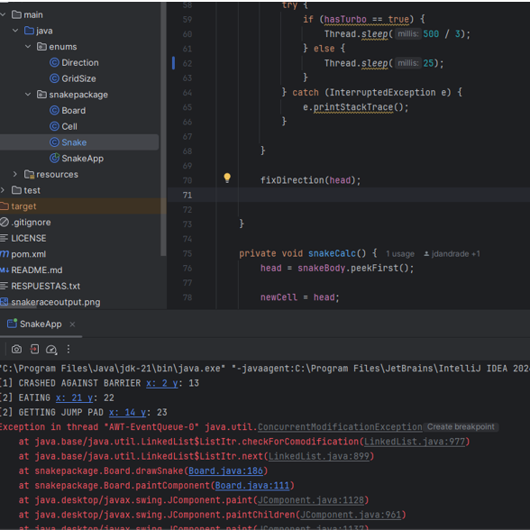

## Respuestas Ejercicio SnakeRace

1. Uso de Hilos en el Código

El juego usa hilos para que cada serpiente se mueva de manera autónoma e independiente. Esto se puede observar en el uso de hilos en las siguientes clases:

### Clase Snake:

Implementa Runnable, lo que permite que cada serpiente se ejecute en un hilo separado.

En el método run(), hay un bucle while (!snakeEnd) que mantiene el hilo activo mientras la serpiente no haya chocado.

Dentro de run(), se llama a snakeCalc() para calcular el siguiente movimiento y luego se usa Thread.sleep(500) para hacer pausas entre movimientos.

### Clase SnakeApp 

Aquí se crean y manejan los hilos.

Se inicializan las serpientes y se crean los hilos con new Thread(snakes[i]).

Se usa thread[i].start() para iniciar cada hilo y permitir que las serpientes se muevan al mismo tiempo.

### Sincronización en el Tablero (Board y Cell)

Para evitar que varias serpientes ocupen la misma celda a la vez, en Cell se usa synchronized en algunos métodos como freeCell().

2. Prueba error: 

